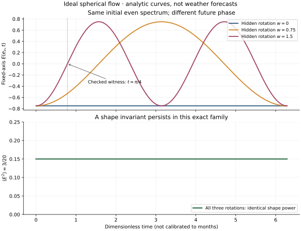

# Parity removal, shape persistence and missing phase dynamics

Date: 2026-09-24. Author: Codex (OpenAI), continuing the user's hypothesis.

**Result:** an exact spherical flow provides both a positive shape example and
a counterexample to forecasting a fixed-axis spectrum from its current value.
Two flows have the same entire initial even spectrum, but different hidden
degree-one rotations. Their even spectra subsequently differ while their
normalized even spectral powers stay equal and constant.

Read the [Chinese derivation and proposed ablations](../../docs/sphaera-parity-and-long-memory.md).
The [contract](contract.json) was written before this finite run.

## Exact model

On the unit sphere, with velocity `u = r × grad ψ`, relative vorticity `ζ = Δψ`
and prescribed planetary rotation `p`, use

```
ψ = -w z + A (x²-y²) + 2 B xy
∂t ζ + {ψ, ζ + 2p z} = 0
c = (2w-p)/3
A' = -2c B, B' = 2c A, w' = 0
```

The symbolic residual is identically zero for arbitrary symbolic `A,B,w,p`.
Dropping `w` from the phase speed makes a nonzero residual. The exact normalized
spectral power is `3(A²+B²)/20`, and angular momentum is `(0,0,2w/3)`.
An additional degree-two plus degree-four probe generates a nonzero odd
vorticity tendency, so keeping only even degrees need not close the dynamics.

For `p=0`, initial `(A,B)=(1,0)`, compare `w=0` with `w=3/2` at `t=π/4`:

| Observer | Both initially | Stationary final | Moving final |
| --- | ---: | ---: | ---: |
| Continuous E at x-axis | -3/4 | -3/4 | 0 |
| Native 16-point E at x-axis | -1.008 | -1.008 | 0 |
| Continuous normalized even power | 3/20 | 3/20 | 3/20 |
| Native odd channel at z-axis | 0 vs 0.504 | 0 | 0.504 |

The finite quadrature is deliberately inherited from the previous experiment.
Its numbers are not substituted for exact continuous integral values.



## What ran natively

The unchanged [previous Rust driver](../sphaera-frame/src/main.rs) parses, links,
compiles, checks diagram import, and evaluates the generated
[Adva source](runs/run-001/dynamics.adva). It preserves actual compiler-created
GraftFrames and certificates in [native.json](runs/run-001/native.json).
New functions compute phase speed, the phase tendency using `turn-i`, and the
even coefficients with explicit discard of `w`. The norm is also native.

The coefficient pair `(A,B)` describes cosine/sine phase **within degree two**.
It is a different interpreted carrier from the earlier parity pair `(E,O)`.
Native `J` supplies the same matrix in both; physics is established here only
by the external model identity. This is not a new native complex-frame type
or a general native PDE solver. No native time integrator was run: Python
supplies the exact initial and final model states and rational tangent winds.

Rational proper rotation matrices transport each of three observation axes to
the previous source program's local z-axis. Position and velocity are both
transported. SymPy checks the PDE and sphere moments externally; Python's
Fraction quadrature supplies an arithmetic reference for the native observer.
These paths share an author and formulation, so they are not independent review.

## Evidence and reproduction

[Run 001 evidence](runs/run-001/evidence.json): **305 checks, 42 native evaluations**,
maximum absolute error **2.220446049250313e-16**. The exact identities and failed
closure witnesses are retained in [symbolic.json](runs/run-001/symbolic.json).
Source, driver, binary, contract and checker hashes are recorded.

```
cd /home/ubuntu/xue-study
uv run --with sympy==1.14.0 python experiments/sphaera-parity-dynamics/check.py \
  --out experiments/sphaera-parity-dynamics/runs/run-002
uv run --with matplotlib python experiments/sphaera-parity-dynamics/plot.py \
  --run experiments/sphaera-parity-dynamics/runs/run-002
```

The first command requires the existing previous-experiment binary; build it
using [its instructions](../sphaera-frame/README.md) if absent. Each checker output
directory must be fresh. Contract limits include 90 seconds checker wall time,
60 seconds checker CPU, 45 seconds native wall, 40 seconds native CPU, 512 native
evaluations, 16 MiB native output, and no automatic continuations. Dependency
installation and the optional plot are outside the finite checker budget.

Dimensionless time has no month calibration. There is no forecast training,
weather skill measurement, assertion of atmospheric angular-momentum
conservation, or proof of a general slowly evolving even-degree state.
